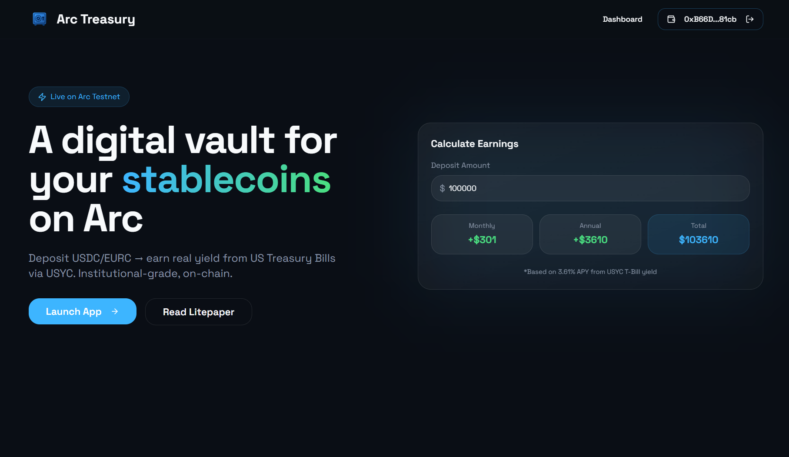
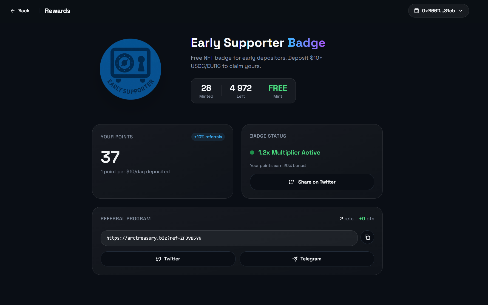

# Arc Treasury

<div align="center">
  <h3>Earn Real Yield on Your Stablecoins</h3>
  <p>DeFi treasury vault with real USYC integration on Arc Network</p>
  <p>
    <a href="https://arctreasury.biz">Live App</a> •
    <a href="https://testnet.arcscan.app/address/0x17ca5232415430bC57F646A72fD15634807bF729">Smart Contract</a> •
    <a href="https://arctreasury.biz/litepaper">Litepaper</a>
  </p>
</div>

## Screenshots

<div align="center">
  
  <p><em>Landing page with yield calculator</em></p>
</div>

<div align="center">
  
  <p><em>Dashboard with flexible deposits and locked positions</em></p>
</div>

<div align="center">
  
  <p><em>Rewards page with Early Supporter Badge and referral program</em></p>
</div>

---

## Overview

Arc Treasury is a decentralized treasury vault that enables users to earn sustainable yield on USDC and EURC stablecoins. Built on Arc Network with **real USYC integration** via the Hashnote Teller contract.

### What is USYC?

**USYC** is the on-chain representation of Hashnote International Short Duration Yield Fund Ltd. (SDYF):
- Invests in **reverse repo on U.S. Government backed securities**
- Issued by **Circle International Bermuda Limited** (regulated by BMA)
- Instant on-chain subscribe/redeem via **Teller contract**
- ~4% APY from Fed rate returns with minimal risk

## Features

### Flexible Deposits
- Deposit USDC or EURC anytime
- Withdraw instantly with no lock-up period
- Earn real USYC APY (~3.99% after 5% platform fee)
- Perfect for liquid savings

### Locked Positions
Earn more Points by locking funds for fixed periods. **APY is the same for all lock periods** - lock bonus gives Points multiplier only:

| Lock Period | APY | Points Multiplier | Min Deposit for Points |
|-------------|-----|-------------------|------------------------|
| Flexible | ~3.99%* | 1x | $100 |
| 1 Month | ~3.99%* | 1.5x | $100 |
| 3 Months | ~3.99%* | 2x | $100 |
| 12 Months | ~3.99%* | 3x | $100 |

*APY is variable based on USYC T-Bill yield (~4.2%) minus 5% platform fee.

Points convert to future ARC token rewards. Early withdrawal available with 25% penalty on principal.

### Points System
- **Minimum $100 deposit** required to earn points (anti-bot protection)
- **Permanent points** - never lost after withdrawal
- **Formula**: 1 point = $10 TVL × 1 day × lock multiplier
- **Deposit bonus**: 1 point per $100 deposited × lock multiplier
- **Referral bonus**: 10% of referral's points (lifetime, single level)
- **NFT boost**: x1.2 multiplier for NFT holders

### Native USDC Bridge
- Bridge USDC from Ethereum Sepolia to Arc Network
- Powered by Circle's CCTP protocol
- Native USDC on both chains (no wrapped tokens)

## How It Works

1. **Deposit USDC** → Funds go to TreasuryVault
2. **Operator converts** → USDC → USYC via Teller contract
3. **USYC earns yield** → From US Treasury reverse repo
4. **Withdraw anytime** → USYC → USDC, receive principal + yield

### USYC Teller Flow

```
USDC → approve(Teller) → deposit(amount, receiver) → USYC minted
USYC → redeem(shares, receiver, owner) → USDC returned + yield
```

## Smart Contracts (Arc Testnet V11)

| Contract | Address | Description |
|----------|---------|-------------|
| TreasuryVault (Proxy) | [`0x17ca5232415430bC57F646A72fD15634807bF729`](https://testnet.arcscan.app/address/0x17ca5232415430bC57F646A72fD15634807bF729) | Upgradeable vault with points system |
| V11 Implementation | [`0x5772b5911bf261b0ca01121f90b80dc3d3cc656c`](https://testnet.arcscan.app/address/0x5772b5911bf261b0ca01121f90b80dc3d3cc656c) | V11 with mintUSYC auto-conversion |
| USYCOracle | [`0x4b4b1dad50f07def930ba2b17fdcb0e565dae4e9`](https://testnet.arcscan.app/address/0x4b4b1dad50f07def930ba2b17fdcb0e565dae4e9) | USYC NAV price oracle |
| USYC Teller | [`0x9fdF14c5B14173D74C08Af27AebFf39240dC105A`](https://testnet.arcscan.app/address/0x9fdF14c5B14173D74C08Af27AebFf39240dC105A) | Circle/Hashnote USDC↔USYC conversion |
| PointsMultiplierNFT | [`0x3eeca3180a2c0db29819ad007ff9869764b97419`](https://testnet.arcscan.app/address/0x3eeca3180a2c0db29819ad007ff9869764b97419) | x1.2 points boost NFT |
| USYC Token | [`0xe9185F0c5F296Ed1797AaE4238D26CCaBEadb86C`](https://testnet.arcscan.app/address/0xe9185F0c5F296Ed1797AaE4238D26CCaBEadb86C) | USYC ERC-20 on Arc |

## Technology Stack

- **Frontend**: React 18, TypeScript, TailwindCSS, Vite
- **Web3**: wagmi v2, viem, RainbowKit
- **Bridge**: Circle CCTP (Cross-Chain Transfer Protocol)
- **Blockchain**: Arc Network Testnet (Chain ID: 5042002)
- **Yield Source**: USYC via Hashnote Teller (real integration)

## Local Development

```bash
# Install dependencies
npm install

# Start development server
npm run dev

# Build for production
npm run build
```

### Contract Scripts

```bash
cd contracts

# Auto-convert USDC to USYC (V11)
npx tsx scripts/autoMintUSYC.ts

# Set treasury operator
npx tsx scripts/setTreasuryOperator.ts

# Upgrade to latest version
npx tsx scripts/upgradeToV11.ts
```

## USYC Integration Details

### Key Discovery: Arc Testnet Native USDC
On Arc Testnet, native USDC (`0x3600000000000000000000000000000000000000`) is also an ERC-20 token. This means:
- Use `approve()` + `deposit()` for Teller (NOT payable/msg.value)
- Teller uses 6 decimals for USDC input
- USYC uses 6 decimals

### Vault Operator Flow (V11)
1. Operator is set via `setTreasuryOperator(address)`
2. `mintUSYC(amount)` - operator calls to convert vault USDC → USYC automatically
3. Vault approves Teller, calls deposit, receives USYC - all in one transaction

### USYC Fees
- Subscription Fee: 0%
- Redemption Fee: 0.1%
- Performance Fee: 10% of yield

## Security

- Non-custodial - you control your keys
- Vault whitelisted by Circle/Hashnote
- Real USYC integration (not simulated)
- On-chain NAV oracle for price feeds

**Testnet Notice**: This is a testnet deployment. Use only test tokens.

## FAQ

**Q: Is the yield real?**
A: Yes! The vault uses the real Hashnote USYC Teller contract. USYC earns yield from US Treasury reverse repo.

**Q: Can I withdraw early from locked positions?**
A: Yes, with 25% penalty on principal. Earned yield is not penalized.

**Q: How is APY calculated?**
A: From USYC NAV changes, reflecting real US Treasury rates (~4.2% base). Arc Treasury takes a 5% platform fee on yield, resulting in ~3.99% net APY for users.

## Links

- **Website**: https://arctreasury.biz
- **Litepaper**: https://arctreasury.biz/litepaper
- **FAQ**: https://arctreasury.biz/faq
- **Circle Faucet**: https://faucet.circle.com/
- **Arc Network**: https://arc.network

## License

MIT License - Arc Treasury 2025
