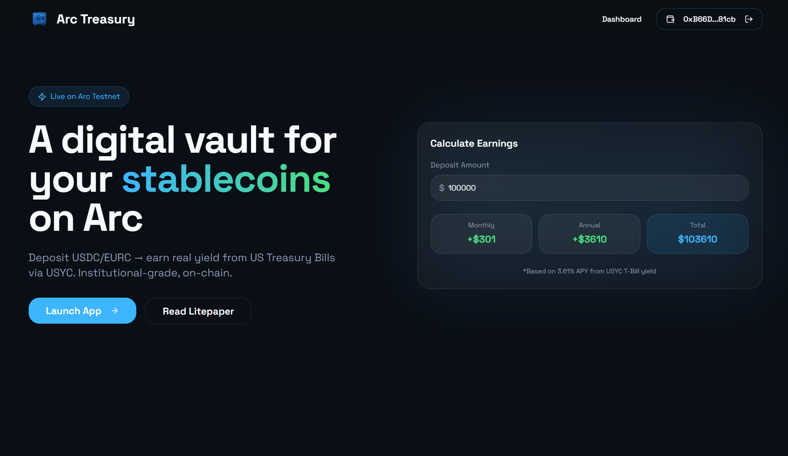
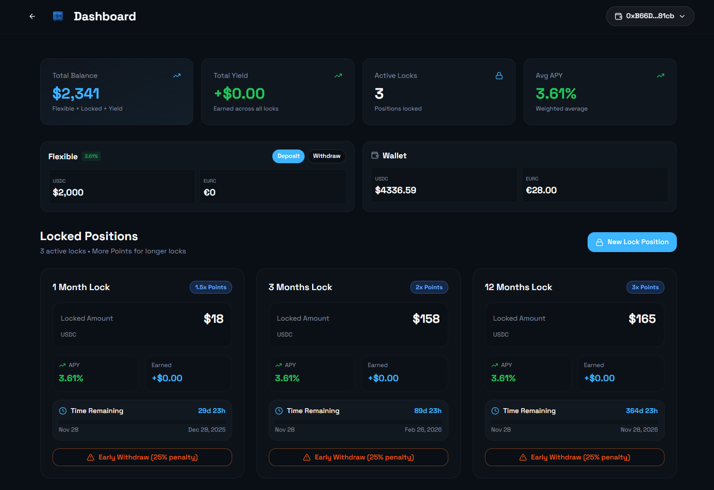
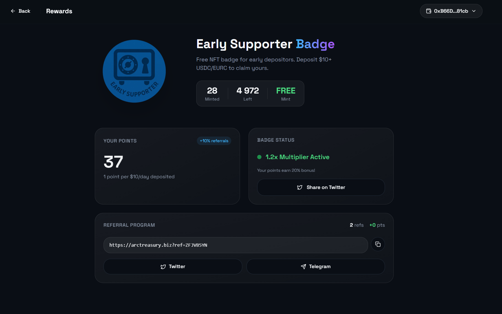

# Arc Treasury

<div align="center">
  <h3>Earn Real Yield on Your Stablecoins</h3>
  <p>DeFi treasury vault with real USYC integration, USDC/EURC AMM swap, and cross-chain bridge on Arc Network</p>

  <p>
    
    
    
    <a href="https://github.com/vizzzix/arc_treasury/actions"></a>
    <a href="https://arctreasury.biz"></a>
    
  </p>

  <p>
    <a href="https://arctreasury.biz">Live App</a> •
    <a href="https://testnet.arcscan.app/address/0x17ca5232415430bC57F646A72fD15634807bF729">Smart Contract</a> •
    <a href="https://arctreasury.biz/litepaper">Litepaper</a>
  </p>
</div>

## Screenshots

<div align="center">
  
  <p><em>Landing page with yield calculator</em></p>
</div>

<div align="center">
  
  <p><em>Dashboard with flexible deposits and locked positions</em></p>
</div>

<div align="center">
  
  <p><em>Rewards page with Early Supporter Badge and referral program</em></p>
</div>

---

## Overview

Arc Treasury is a decentralized treasury vault that enables users to earn sustainable yield on USDC and EURC stablecoins. Built on Arc Network with **real USYC integration** via the Hashnote Teller contract.

### What is USYC?

**USYC** is the on-chain representation of Hashnote International Short Duration Yield Fund Ltd. (SDYF):
- Invests in **reverse repo on U.S. Government backed securities**
- Issued by **Circle International Bermuda Limited** (regulated by BMA)
- Instant on-chain subscribe/redeem via **Teller contract**
- ~4% APY from Fed rate returns with minimal risk

## Features

### Dual Wallet Support
- **MetaMask / External wallets** — direct on-chain transactions via wagmi/viem
- **Google OAuth (Circle wallet)** — custodial wallet powered by Circle Developer Controlled Wallets, no browser extension needed

### Flexible Deposits
- Deposit USDC or EURC anytime
- Withdraw instantly with no lock-up period
- Earn real USYC APY (~3.99% after 5% platform fee)

### Locked Positions
Earn more Points by locking funds for fixed periods. **APY is the same for all lock periods** — lock bonus gives Points multiplier only:

| Lock Period | APY | Points Multiplier | Min Deposit |
|-------------|-----|-------------------|-------------|
| Flexible | ~3.99%* | 1x | $100 |
| 1 Month | ~3.99%* | 1.5x | $100 |
| 3 Months | ~3.99%* | 2x | $100 |
| 12 Months | ~3.99%* | 3x | $100 |

*APY is variable based on USYC T-Bill yield (~4.2%) minus 5% platform fee.

Early withdrawal available with 25% penalty on principal.

### USDC/EURC Swap (AMM)
- On-chain AMM pool with 0.2% fee
- Add/remove liquidity with LP tokens
- Real-time EUR/USD exchange rate integration

### Cross-Chain Bridge
- Bridge USDC between Ethereum Sepolia and Arc Network
- Powered by Circle CCTP V2 (native USDC, no wrapped tokens)
- Solana bridge support via Circle Bridge Kit

### Points & Rewards
- **Permanent points** — never lost after withdrawal
- **Formula**: 1 point = $10 TVL × 1 day × lock multiplier
- **Referral bonus**: 10% of referral's points (lifetime)
- **Early Supporter Badge**: x1.2 points multiplier NFT

## Architecture

```
┌─────────────────────────────────────────────────┐
│                   Frontend                       │
│  React + Vite + TailwindCSS + shadcn/ui          │
│                                                   │
│  ┌──────────────┐    ┌───────────────────┐       │
│  │  MetaMask     │    │  Google OAuth      │       │
│  │  wagmi/viem   │    │  Circle Wallets    │       │
│  └──────┬───────┘    └────────┬──────────┘       │
│         │                     │                    │
│         │  useUnifiedWallet() │                    │
│         └──────────┬──────────┘                    │
└────────────────────┼───────────────────────────────┘
                     │
        ┌────────────┼────────────┐
        │            │            │
   ┌────▼────┐  ┌────▼────┐  ┌───▼────┐
   │ Vault   │  │  Swap   │  │ Bridge │
   │ api/    │  │  Pool   │  │ CCTP   │
   │ vault.ts│  │         │  │ api/   │
   └────┬────┘  └────┬────┘  │bridge.ts│
        │            │       └───┬────┘
        └────────────┼───────────┘
                     │
        ┌────────────▼────────────┐
        │    Arc Testnet (5042002) │
        │  USDC (native) · EURC   │
        │  TreasuryVault · Swap   │
        └─────────────────────────┘
```

### How Yield Works

1. **Deposit USDC/EURC** → Funds go to TreasuryVault
2. **Operator converts** → USDC → USYC via Hashnote Teller
3. **USYC earns yield** → From US Treasury reverse repo (~4.2% APY)
4. **Withdraw anytime** → USYC → USDC, receive principal + yield

## Smart Contracts (Arc Testnet)

| Contract | Address | Description |
|----------|---------|-------------|
| TreasuryVault (Proxy) | [`0x17ca5232415430bC57F646A72fD15634807bF729`](https://testnet.arcscan.app/address/0x17ca5232415430bC57F646A72fD15634807bF729) | UUPS upgradeable vault (V14) |
| StablecoinSwap | [`0x3a5964ce5cd8b09e55af9323a894e78bdd7f04bf`](https://testnet.arcscan.app/address/0x3a5964ce5cd8b09e55af9323a894e78bdd7f04bf) | USDC/EURC AMM, 0.2% fee |
| EURC | [`0x742b2d045d430fe718b57046645ba33295914b69`](https://testnet.arcscan.app/address/0x742b2d045d430fe718b57046645ba33295914b69) | EUR stablecoin, 6 decimals |
| EarlySupporterBadge | [`0xb26a5b1d783646a7236ca956f2e954e002bf8d13`](https://testnet.arcscan.app/address/0xb26a5b1d783646a7236ca956f2e954e002bf8d13) | x1.2 points boost NFT |
| USYCOracle | [`0xfe51166b831cd55737a1e1231a811ada0d7b3378`](https://testnet.arcscan.app/address/0xfe51166b831cd55737a1e1231a811ada0d7b3378) | USYC NAV price oracle |
| USYC Teller | [`0x9fdF14c5B14173D74C08Af27AebFf39240dC105A`](https://testnet.arcscan.app/address/0x9fdF14c5B14173D74C08Af27AebFf39240dC105A) | USDC/USYC conversion |
| USYC Token | [`0xe9185F0c5F296Ed1797AaE4238D26CCaBEadb86C`](https://testnet.arcscan.app/address/0xe9185F0c5F296Ed1797AaE4238D26CCaBEadb86C) | Hashnote yield token, 6 dec |
| Entitlements | [`0xcc205224862c7641930c87679e98999d23c26113`](https://testnet.arcscan.app/address/0xcc205224862c7641930c87679e98999d23c26113) | USYC allowlist manager |

### CCTP V2 (Sepolia ↔ Arc)

| Contract | Address | Notes |
|----------|---------|-------|
| TokenMessenger | `0x8FE6B999Dc680CcFDD5Bf7EB0974218be2542DAA` | Sepolia domain=0, Arc domain=26 |
| MessageTransmitter | `0xE737e5cEBEEBa77EFE34D4aa090756590b1CE275` | Same address on both chains |
| USDC (Sepolia) | `0x1c7D4B196Cb0C7B01d743Fbc6116a902379C7238` | 6 decimals |
| USDC (Arc) | `0x3600000000000000000000000000000000000000` | Native gas token, 18 decimals |

## Technology Stack

<p align="center">
  <a href="https://skillicons.dev">
    
  </a>
</p>

| Layer | Technologies |
|-------|-------------|
| Frontend | React 18, TypeScript, Vite, TailwindCSS, shadcn/ui |
| Web3 | wagmi v2, viem, Circle Developer Controlled Wallets |
| Bridge | Circle CCTP V2, Circle Bridge Kit (Solana) |
| Backend | Vercel Serverless Functions (Node.js) |
| Database | Supabase (PostgreSQL + Realtime) |
| Auth | Google OAuth via Supabase Auth |
| Blockchain | Arc Testnet (Chain ID: 5042002) |
| Yield | USYC via Hashnote Teller |

## Project Structure

```
arc_treasury/
├── api/                    # Vercel serverless endpoints
│   ├── _lib/               # Shared utilities (Circle SDK, Supabase)
│   ├── vault.ts            # Deposit/withdraw/swap for Circle wallets
│   ├── bridge.ts           # CCTP V2 bridge operations
│   ├── wallet.ts           # Circle wallet management
│   ├── circle.ts           # CCTP attestation proxy
│   ├── twitter.ts          # Twitter OAuth for points boost
│   ├── referral.ts         # Referral system
│   └── support/            # Support ticket system
├── src/
│   ├── pages/              # Route pages
│   ├── components/         # UI components
│   ├── hooks/              # React hooks (vault, swap, bridge, etc.)
│   ├── providers/          # Context providers (Circle wallet)
│   └── lib/                # Utilities, ABIs, constants
├── contracts/              # Solidity contracts + Hardhat scripts
└── supabase/               # Database migrations
```

## Getting Started

### Prerequisites

- Node.js 20+
- npm

### Installation

```bash
git clone https://github.com/vizzzix/arc_treasury.git
cd arc_treasury
npm install
```

### Environment Variables

Copy `.env.example` and fill in your values:

```bash
cp .env.example .env
```

Required variables:
- `VITE_SUPABASE_URL` / `VITE_SUPABASE_ANON_KEY` — Supabase project
- `CIRCLE_API_KEY` — Circle Developer Controlled Wallets
- `SUPABASE_SERVICE_ROLE_KEY` — server-side Supabase access

### Development

```bash
npm run dev        # Start dev server on http://localhost:8080
npm run build      # Production build
npm run preview    # Preview production build
```

## Testing

```bash
npm test           # Run 203 unit tests (vitest)
npm run test:e2e   # Run 29 E2E tests (Playwright)
npm run test:e2e:ui # E2E with interactive UI
```

Tests cover:
- Bridge API endpoints (approve, burn, claim, tx-status)
- Vault logic (deposit, withdraw, swap, liquidity)
- Swap pool calculations (slippage, min output)
- Locked positions (yield, mapping, early withdraw)
- E2E smoke tests for all pages

## Security

- **JWT authentication** on all financial API endpoints (vault, bridge, wallet)
- **Wallet ownership verification** — users can only operate on their own wallets
- **Rate limiting** with Upstash Redis (sliding window) on all endpoints
- **Input validation** — UUID, address, txHash format checks
- **CORS whitelist** — only allowed origins
- **Security headers** — X-Frame-Options, X-Content-Type-Options, Referrer-Policy
- **Sentry error monitoring** with source map upload
- Non-custodial for MetaMask users
- Circle wallet keys managed by Circle's HSM infrastructure
- Server-side transaction execution for Circle wallets (no private keys in browser)
- Vault whitelisted by Circle/Hashnote for USYC operations
- Real USYC integration (not simulated)
- On-chain NAV oracle for price feeds

**Testnet Notice**: This is a testnet deployment. Use only test tokens.

## Links

- **Website**: https://arctreasury.biz
- **Litepaper**: https://arctreasury.biz/litepaper
- **FAQ**: https://arctreasury.biz/faq
- **Explorer**: https://testnet.arcscan.app
- **Circle Faucet**: https://faucet.circle.com/
- **Arc Network**: https://arc.network

## License

MIT License - Arc Treasury 2025-2026
